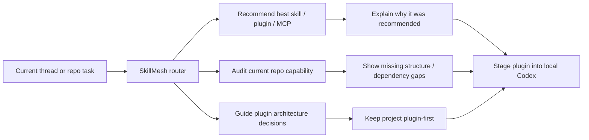

# SkillMesh

> The plugin-first Skill OS for Codex.

<p align="left">
  <a href="https://github.com/Yike-Lin/SkillMesh/stargazers"></a>
  <a href="https://github.com/Yike-Lin/SkillMesh/commits/main"></a>
  
  
  
</p>


SkillMesh is a **Codex plugin project** that turns scattered `skills / plugins / MCP` into a usable in-thread operating layer:

- recommend the right capability for the current task
- explain why it was recommended
- audit what already exists in a repo
- bridge local installation and dependency wiring

It is **not** a standalone dashboard anymore.  
Visualization, graph views, and admin surfaces belong in a future companion app, not in this repository.

## At a Glance

- plugin-first, thread-local, Codex-native
- focused on recommendation, explanation, audit, and install bridging
- clean repo with no leftover dashboard code
- designed to become the control layer for `skills / plugins / MCP`

## Why SkillMesh

Most agent tooling stops at one of these layers:

- a skill list
- an installer
- a recommendation panel
- a graph view

SkillMesh is opinionated about the missing loop:

`discover -> understand -> install -> recommend -> execute -> improve`

The goal is simple: make Codex threads aware of what they can use, when they should use it, and what is missing before execution starts.

## How It Works



## What This Repo Is

This repository is a **clean Codex plugin repo**.

It currently contains:

- a plugin manifest
- plugin-level assets
- thread-local skills
- a local install/staging script
- product and schema docs

It does **not** contain the old frontend dashboard code anymore.

## Core Capabilities

### 1. Skill routing

SkillMesh decides whether the current task needs:

- recommendation
- inventory audit
- plugin architecture guidance

### 2. In-thread recommendation

SkillMesh can recommend the most relevant `skill / plugin / MCP` combination for the current repo or thread, and explain the reasoning.

### 3. Repository capability audit

SkillMesh can inspect what plugin-related structure already exists:

- plugin manifest
- installed skills
- agent metadata
- missing MCP or app mappings
- installation gaps

### 4. Local Codex plugin workflow

SkillMesh includes a script to:

- stage the plugin into the local Codex plugin directory
- update the personal marketplace entry
- rewrite the cachebuster version
- validate the staged plugin

## Example Prompts

Use prompts like these in a new Codex thread:

- `Use SkillMesh to audit what plugin-related capability already exists in this repo.`
- `Recommend the best skills / plugins / MCP combination for the task I am doing now.`
- `Help me turn this project into a real Codex plugin instead of a standalone app.`
- `Show me what is missing before this plugin is safe to install and use.`

## Repository Layout

```text
.codex-plugin/
  plugin.json
assets/
  skillmesh.svg
skills/
  skillmesh/
  skillmesh-advisor/
  skill-inventory-audit/
  codex-plugin-architect/
scripts/
  install-local-plugin.ps1
docs/
  PRD-lite.md
  schema.sql
```

## Skills Included

### `skillmesh`

Top-level router skill.  
Decides whether the task should go to recommendation, audit, or plugin-architecture guidance.

### `skillmesh-advisor`

Recommends the best `skills / plugins / MCP` combination for the current task.

### `skill-inventory-audit`

Audits the current repository for plugin-related capability and structure.

### `codex-plugin-architect`

Helps shape a project into a real Codex plugin instead of a standalone app.

## Quick Start

### 1. Validate the plugin

```powershell
python C:\Users\Administrator\.codex\skills\.system\plugin-creator\scripts\validate_plugin.py .
```

### 2. Stage it into local Codex

```powershell
powershell -ExecutionPolicy Bypass -File .\scripts\install-local-plugin.ps1
```

This script will:

1. prepare `%USERPROFILE%\plugins\skillmesh`
2. update the personal marketplace entry
3. rewrite the staged plugin version with a Codex cachebuster
4. validate the staged plugin
5. print Codex app deeplinks for viewing or sharing the plugin

### 3. Open it in Codex

After staging, open the plugin in the Codex app and enable/install it there if your local CLI build does not expose plugin install commands.

Then start a **new Codex thread** so the latest skills are picked up cleanly.

## Who This Is For

SkillMesh is built for:

- Codex power users with growing local skill catalogs
- teams building internal skill bundles
- plugin authors who want cleaner in-thread capability routing
- agent workflow designers who care about recommendation quality and dependency clarity

## Project Direction

SkillMesh is intentionally split across two surfaces:

- **this repo**: Codex plugin, thread-local reasoning, install bridge
- **future companion surface**: graph view, analytics, bulk management, publishing workflows

That boundary keeps the plugin focused and keeps the repo clean.

## Roadmap

- [x] turn SkillMesh into a real Codex plugin repo
- [x] remove the old frontend dashboard code
- [x] add local plugin staging and validation flow
- [x] add thread-local routing and audit skills
- [ ] add stronger repo-signal-based recommendation logic
- [ ] add optional MCP bridge when runtime needs become real
- [ ] publish a shareable marketplace-based distribution path

## What Makes This Repo Worth Watching

- it is solving a real gap between static skill catalogs and actual in-thread capability routing
- it stays strict about plugin boundaries instead of drifting back into dashboard-first scope
- it is already installable as a local Codex plugin
- it is building toward a shareable marketplace distribution path instead of staying a one-off local hack

## Philosophy

SkillMesh does not want to be another static catalog.

It wants to answer three higher-value questions inside the thread:

1. what should run now
2. why this is the right capability
3. what is missing before execution is actually safe

If that works well, SkillMesh becomes more than a plugin list. It becomes the control layer for how Codex uses capability.

## Docs

- [PRD-lite](./docs/PRD-lite.md)
- [Schema draft](./docs/schema.sql)

## Status

Active local plugin development.

If this project direction is interesting, star the repo and watch the next milestone: turning recommendation + audit into a genuinely useful in-thread Skill OS for Codex.
