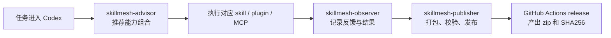

# SkillMesh

> 把分散的 `skills / plugins / MCP` 变成 Codex 里可推荐、可观测、可分发的插件能力层。

<p align="left">
  <a href="https://github.com/Yike-Lin/SkillMesh/stargazers"></a>
  <a href="https://github.com/Yike-Lin/SkillMesh/commits/main"></a>
  
  
</p>

SkillMesh 现在不是大屏，不是独立 Web App。

它就是一个 **Codex 插件工程**，专门解决三件事：

- 当前任务该用什么 `skill / plugin / MCP`
- 这些推荐到底有没有用
- 这个插件怎么校验、安装、打包、分发

## 已实现功能

- `skillmesh-advisor`
  - 按任务、仓库文件、语言和框架做推荐排序
  - 给出推荐原因和依赖检查
- `skill-inventory-audit`
  - 盘点仓库里的 skills、插件结构、MCP / app 缺口
- `skillmesh-observer`
  - 记录推荐反馈
  - 记录 skill 执行结果
  - 输出统计报告
- `skillmesh-publisher`
  - 做本地插件安装
  - 跑官方插件校验
  - 校验 release 目录和 zip
  - 生成 zip 和 SHA256

## 流程图



## 可扩展功能

- 推荐规则继续增强：
  - 更细的任务意图识别
  - 更强的已安装生态感知
- 数据层继续增强：
  - skill 版本
  - 安装目标
  - flow 模板
- 分发层继续增强：
  - GitHub Release 自动化
  - 发布校验流水线
  - 公开 marketplace 适配

## 快速安装

先校验：

```powershell
python C:\Users\Administrator\.codex\skills\.system\plugin-creator\scripts\validate_plugin.py .
```

再安装到本地 Codex：

```powershell
powershell -ExecutionPolicy Bypass -File .\scripts\install-local-plugin.ps1
```

安装脚本会自动：

- 同步插件到 `%USERPROFILE%\plugins\skillmesh`
- 更新个人 marketplace 条目
- 写入 cachebuster 版本
- 校验 staged plugin
- 输出 Codex app deeplink

## 自动发布

仓库已经带了 [`.github/workflows/release.yml`](./.github/workflows/release.yml)：

- 平时可以手动触发，先跑测试和打包
- 推送 `v*` tag 时会自动上传 zip 和 SHA256 到 GitHub Release

## 典型用法

在 Codex 里直接说：

- `使用 $skillmesh-advisor 推荐这个任务该用什么 skills / plugins / MCP`
- `使用 $skill-inventory-audit 盘点当前仓库里的插件能力`
- `使用 $skillmesh-observer 看一下这个仓库最近的推荐和运行统计`
- `使用 $skillmesh-publisher 校验并构建这个插件的发布产物`

## 验收清单

- 最小线程验收清单：[`docs/acceptance-checklist.md`](./docs/acceptance-checklist.md)
- 真实线程验收记录模板：[`docs/thread-acceptance-report.md`](./docs/thread-acceptance-report.md)
- 发布前检查：先跑清单里的 3 句核心测试，再按需补第 4 句观测测试

## 仓库里这些文件在干什么

- [`.codex-plugin/plugin.json`](./.codex-plugin/plugin.json)：插件清单
- [`skills/`](./skills)：插件内置 skills
- [`scripts/skillmesh.py`](./scripts/skillmesh.py)：推荐、反馈、观测、本地数据引擎
- [`scripts/install-local-plugin.ps1`](./scripts/install-local-plugin.ps1)：本地安装脚本
- [`scripts/validate-release.py`](./scripts/validate-release.py)：release 包校验
- [`config/recommendation-rules.json`](./config/recommendation-rules.json)：推荐规则
- [`docs/schema.sql`](./docs/schema.sql)：SQLite schema

## 当前状态

SkillMesh 目前已经是一个可以本地安装、可推荐、可观测、可继续扩展分发能力的 Codex 插件。
